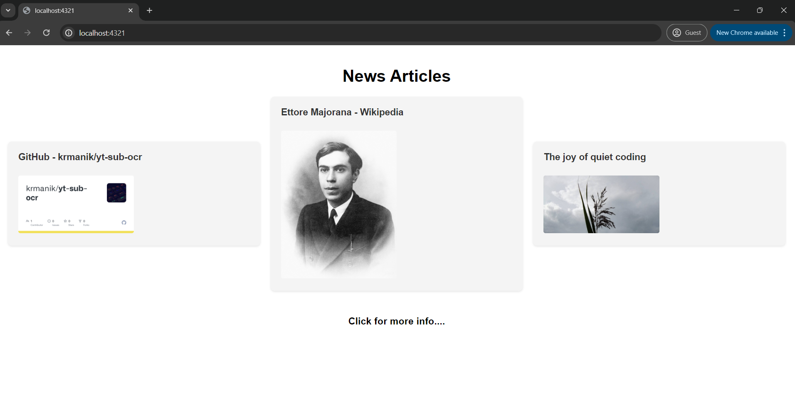

## About the Application
It is a Decentralised web app which uses the power of Chainlink Functions to get news feed information of off-chain and make on-chain state changes in the smart contract.

## Running the Application
1. Clone the Repository
1. npm install
2. npm run dev

## How is it built
The smart contract is built with Solidity while the frontend is basically astro framework.

## Steps before Running the Application
Load enough Sepolia ETH and LINK tokens in your Metamask wallet for creation of Subscription as well as Deploying of Contract. 
You can use the below faucets for the same.  
[https://www.alchemy.com/faucets/ethereum-sepolia](https://www.alchemy.com/faucets/ethereum-sepolia)  
[https://faucets.chain.link/sepolia][https://faucets.chain.link/sepolia]

## Application When Running

